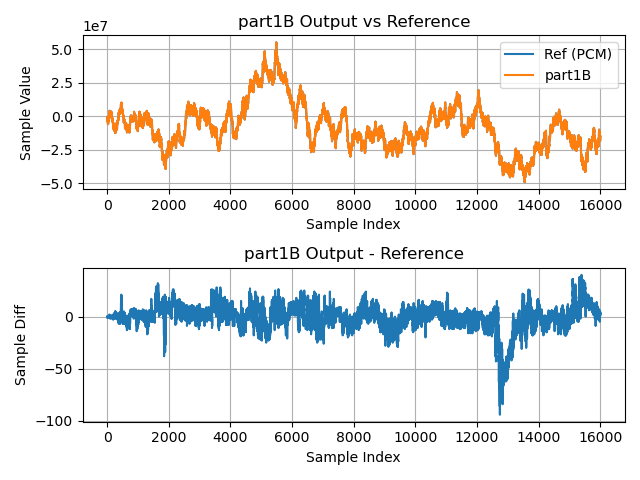

# Part 1B

Like [**Part 1A**](part1A.md), **Part 1B** implements the FIR filter using
floating-point logic written in a plain C loop. Instead of using
double-precision floating-point values (`double`) like **Part 1A**, **Part 1B**
uses single-precision floating-point values (`float`).

xcore.ai devices include a scalar floating-point unit for single-precision
floating-point arithmetic, including instructions for multiplication, addition
and a fused multiply-accumulate. Comparable operations in double-precision
require significant software involvement and so are much slower. In this stage
we'll see that we get a large performance boost just by using the FPU advantageously.

## Implementation

Comparing the code in `part1B.c` to the code from `part1A.c`, we see that the
only real difference is that all `double` values have been replaced with `float`
values.

Similarly, the **Part 1B** application includes [`filter_coef_float.c`](TODO)
(rather than `filter_coef_double.c`) which defines `filter_coef[]` as a vector
of `float` values.

Because **Part 1B** is so similar to **Part 1A**, implementations for
`filter_task()`, `rx_frame()` and `tx_frame()` won't be shown here.

### Part 1B `filter_sample()` Implementation

```{literalinclude} ../src/part1B/part1B.c
---
language: C
start-after: +filter_sample
end-before: -filter_sample
---
```

Here we see `filter_sample()` in **Part 1B** is identical to that in **Part
1A**, except for `float` being used in place of `double`.

## Results

### Timing

| Timing Type       | Measured Timing
|-------------------|-----------------------
| Per Filter Tap    | 75.20 ns
| Per Output Sample | 77.00000 us
| Per Frame         | 19.77849200 ms

### Output Waveform

