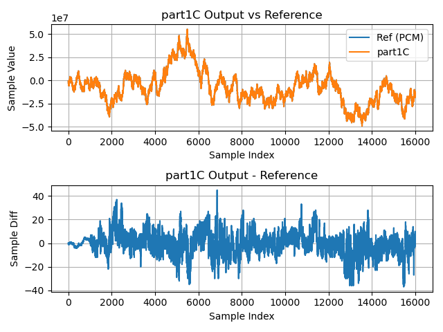

# Part 1C

Like [**Part 1B**](part1B.md), **Part 1C** implements the FIR filter using
single-precision floating-point arithmetic. However, instead of implementing the
inner product directly with a plain C loop, **Part 1C** makes a call to a
library function, `vect_f32_dot()` provided by `lib_xcore_math`.

Rather than relying on the compiler to produce fast floating-point logic,
`vect_f32_dot()` was hand-written in optimized XS3 assembly to go as quickly as
possible. Here we expect to see another significant performance boost.

There are two main reasons for this speed-up. First, the C compiler does not, by
default, emit dual-issue implementations of C functions. And second, custom assembly can avoid doing any unnecessary error checking that might be done in C.

`vect_f32_dot()` takes advantage of both of these.

### From `lib_xcore_math`

This stage makes use of the following operations from `lib_xcore_math`:

* [`vect_f32_dot()`](https://github.com/xmos/lib_xcore_math/blob/v2.1.1/lib_xcore_math/api/xmath/vect/vect_s32.h#L399-L480)

#### `vect_f32_dot()`

```C
C_API
float vect_f32_dot(
    const float b[],
    const float c[],
    const unsigned length);
```

`vect_s32_dot()` takes two `float` vectors, `b[]` and `c[]` (each with `length`
elements), multiplies them together element-wise, and then sums up the products.
The result should be the same as the C implementation of `filter_sample()` from
**Part1B**, only a lot faster.


## Implementation

**Part 1C** uses the exact same implementation as **Part 1B** for
`filter_task()`, `rx_frame()` and `tx_frame()`. The only change is the
implementation of `filter_sample()`.

### Part 1C `filter_sample()` Implementation

```{literalinclude} ../src/part1C/part1C.c
---
language: C
start-after: +filter_sample
end-before: -filter_sample
---
```

Whereas **Part 1B** implemented `filter_sample()` by looping over the filter
taps, **Part 1C** instead just makes a call to `vect_f32_dot()` from
`lib_xcore_math`.


## Results

### Timing

| Timing Type       | Measured Timing
|-------------------|-----------------------
| Per Filter Tap    | 21.13 ns
| Per Output Sample | 21641.67 ns
| Per Frame         | 5608909.00 ns

### Output Waveform

