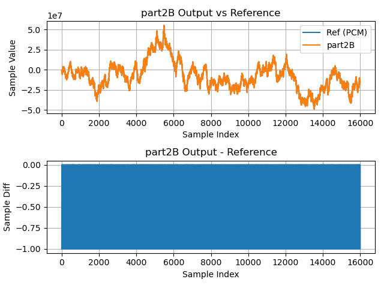

# Part 2B

Like [**Part 2A**](part2A.md), **Part 2B** implements the FIR filter
using fixed-point arithmetic. 

In **Part 2A** we implemented the fixed-point arithmetic directly in plain C. As
such, we were left to hope that the compiler generates an efficient sequence of
instructions to do the work. However, there are reasons to doubt the compiler
generates an optimal implementation. 

One reason is that the C compiler will not target the VPU when compiling code.
Another is that the compiler will not ordinarily generate dual-issue
implementations of functions written in C.

In **Part 2B**, instead of implementing the logic in a plain C loop, we use a
function written in dual-issue assembly to compute the inner product for us.
That function, `int32_dot()`, does not use the VPU (we'll use the VPU in the
next stage), but is meant to demonstrate the improved performance we get just
from using a dual-issue function written directly in assembly.

## Implementation

In this part, `filter_task()`, `rx_frame()` and `tx_frame()` are identical to
those in **Part 2A**.

### **Part 2B** `filter_sample()` Implementation

```{literalinclude} ../src/part2B/part2B.c
---
language: C
start-after: +filter_sample
end-before: -filter_sample
---
```

Notice that the only difference compared to **Part 2A** is that instead of a loop it is calling `int32_dot()`.

```{literalinclude} ../src/part2B/part2B.c
---
language: C
start-after: +int32_dot
end-before: -int32_dot
---
```

`int32_dot()` takes two `int32_t` arrays of length `length` and computes a
direct inner product as an `int64_t` output. That is

$$
  \mathtt{int32\_dot} \to \sum_{k=0}^{\mathtt{length}-1} {\mathtt{x}[k] \cdot \mathtt{y}[k]}
$$

If you are interested, take a look at [`int32_dot.S`](TODO) for the
implementation.

One thing to point out is the [inner loop](TODO) (from `.L_loop_top:` to
`.L_loop_bot:`) of `int32_dot.S` is only 4 instructions long. A disassembly of
the **Part 2A** firmware (`xobjdump -D bin/stage3.xe`) shows that in this case
the inner loop of the (single-issue) `filter_frame()` in **Part 2A** is 7
instructions long.

## Results

The ratio of **Part 2B**'s execution time to **Part 2A**'s execution time is
almost exactly `(4/7)`.

### Timing

| Timing Type       | Measured Timing
|-------------------|-----------------------
| Per Filter Tap    | 33.62 ns
| Per Output Sample | 34425.00 ns
| Per Frame         | 8881434.00 ns

### Output Waveform

