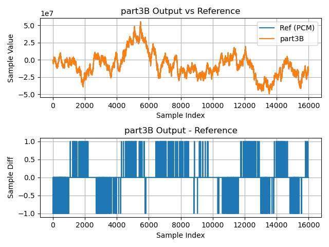

# Part 3B

Like [**Part 3A**](part3A.md), **Part 3B** implements the FIR filter 
using block floating-point arithmetic.

In **Part 3A** we implemented the block floating-point FIR filter using plain C.
We had to manage exponents and headroom ourselves, as well as the logic for
computing the inner product, which was similar to that in [**Part
2A**](part2A.md).

In **Part 3B** we will use the same data structures as **Part 3A** to represent
the BFP vectors, but we will replace our C code which calculates and manages
headroom and exponents with calls to functions from `lib_xcore_maths's low-level
vector API to do some of this work for us. We also replace our `for` loop where
the inner product is computed with a call to `vect_s32_dot()`, which we
encountered in [**Part 2C**](part2C.md).

This will also mean using the VPU to do the bulk of the work, rather than the
scalar unit.

### From `lib_xcore_math`

This page references the following operations from `lib_xcore_math`:

* [`vect_s32_headroom()`](https://github.com/xmos/lib_xcore_math/blob/v2.1.1/lib_xcore_math/api/xmath/vect/vect_s32.h#L554-L591)
* [`vect_s32_dot()`](https://github.com/xmos/lib_xcore_math/blob/v2.1.1/lib_xcore_math/api/xmath/vect/vect_s32.h#L399-L480)
* [`vect_s32_dot_prepare()`](https://github.com/xmos/lib_xcore_math/blob/v2.1.1/lib_xcore_math/api/xmath/vect/vect_s32_prepare.h#L182-L252)
* [`vect_s32_shr()`](https://github.com/xmos/lib_xcore_math/blob/v2.1.1/lib_xcore_math/api/xmath/vect/vect_s32.h#L1200-L1239)

## Implementation

In **Part 3B**, `filter_task()`, `rx_frame()`, and `tx_frame()` are all
identical to those in **Part 3A**, and are omitted here.

### **Part 3B** `calc_headroom()` Implementation

```{literalinclude} ../src/part3B/part3B.c
---
language: C
start-after: +calc_headroom
end-before: -calc_headroom
---
```

Here we see that in **Part 3B**, `calc_headroom()` is just a wrapper around
`vect_s32_headroom()`. This is not only much simpler, but also much, much
faster. `vect_s32_headroom()` still has to iterate over the entire `vec[]` array
to determine the headroom, but unlike our C implementation,
`vect_s32_headroom()` uses the VPU's dedicated headroom hardware to deal with 8
elements every 3 instructions.

A quick examination of **Part 3A**'s `calc_headroom()` disassembly indicates
that it handles 1 element about every 10 instructions.

### **Part 3B** `filter_frame()` Implementation

```{literalinclude} ../src/part3B/part3B.c
---
language: C
start-after: +filter_frame
end-before: -filter_frame
---
```

In **Part 3B**, `filter_frame()` is a little different than **Part 3A**. **Part
3B** makes use of `vect_s32_dot_prepare()` from `lib_xcore_math` to help
determine an output exponent and shift values for us. We saw
`vect_s32_dot_prepare()` in [**Part 3**](part3.md#_prepare-functions-in-lib_xcore_math).

Briefly, `vect_s32_dot_prepare()` takes the exponents and headroom of the two
input vectors as well as the length of the vectors and uses those to determine
the output exponent, and two `right_shift_t` values that need to be passed to
`vect_s32_dot()`.

There is a complication here. `vect_s32_dot()` (and `filter_sample()`) return
`int64_t` values. (This is typical for 32-bit vector functions in
`lib_xcore_math` which return scalars, such as `vect_s32_dot()`,
`vect_s32_energy()` and `vect_s32_sum()`). Because the VPU's accumulators in
32-bit more are 40 bits, we know that to be safe we need to shift the result an
extra 8 bits.

So, we add 8 to the exponent given by vect_s32_dot_prepare() and shift the
result of `filter_sample()` by 8 bits.

```{note} 
Instead of shifting the output of `filter_sample()` by 8 bits, we could have
instead added a total of 8 between the `b_shr` and `c_shr` output by
`vect_s32_dot_prepare()`, however because those shifts are applied prior to
multiplication, adding to them may result in unnecessary loss of precision.
```

### **Part 3B** `filter_sample()` Implementation

```{literalinclude} ../src/part3B/part3B.c
---
language: C
start-after: +filter_sample
end-before: -filter_sample
---
```

`filter_sample()` takes the sample history and the shift parameters generated by
`vect_s32_dot_prepare()` and calls `vect_s32_dot()` much like in **Part 2C**,
except now the 64-bit result is returned.

### **Part 3B** `rx_and_merge_frame()` Implementation

```{literalinclude} ../src/part3B/part3B.c
---
language: C
start-after: +rx_and_merge_frame
end-before: -rx_and_merge_frame
---
```

The only difference between `rx_and_merge_frame()` between **Part 3A** and
**Part 3B** is how the samples are actually shifted. Instead of looping over
samples one by one, **Part 3B** calls `vect_s32_shr()`, which uses the VPU to
apply a signed, arithmetic, saturating right-shift.


## Results

### Timing

| Timing Type       | Measured Timing
|-------------------|-----------------------
| Per Filter Tap    | 15.14 ns   
| Per Output Sample | 15498.91 ns
| Per Frame         | 4054082.75 ns

### Output Waveform

