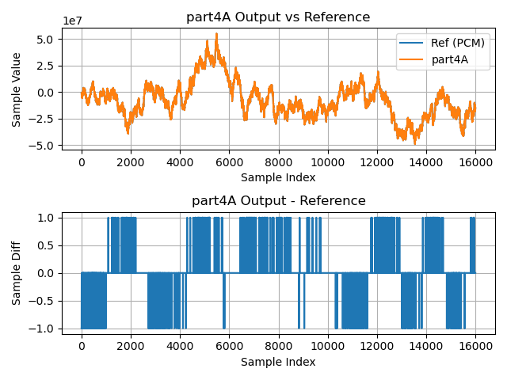

[Prev](partD.md) | [Home](../intro.md) | [Next](stage10.md)

# Stage 9

Up to this point, all previous stages do all of their filter computation in a
single hardware thread. Each tile on an xcore XS3 device has 8 hardware threads
available, and most of these threads have so far gone unused. In **Stage 9** the
application will be parallelized so that the filter computation will span
several threads to reduce latency.

**Stage 9** will take a block floating-point approach most similar to that of
[**Stage 7**](stage7.md). The reason this stage is modeled on **Stage 7**
instead of [**Stage 8**](stage8.md) is because `lib_xcore_math`'s high-level BFP
API will not play nicely with this sort of parallelism. For advanced usage like
this, the lower level API is required.

## Introduction

## Background

## Implementation

**Stage 9** has its implementation split across two files, [`stage9.c`](TODO) and [`stage9.xc`](TODO). The only function implemented in `stage9.xc` is `filter_frame()`, and this is because writing it in XC allows us to take advantage of the XC language's convenient syntax for synchronous parallel operations using a `par` block.

In fact, in **Stage 9**, the only function which is implemented differently than in **Stage 7** is `filter_frame()`.

### **Stage 9** `filter_frame()` Implementation

From [`stage9.xc`](TODO):
```C
// Calculate entire output frame
void filter_frame(
    int32_t* unsafe frame_out,
    exponent_t* frame_out_exp,
    headroom_t* frame_out_hr,
    const int32_t history_in[HISTORY_SIZE],
    const exponent_t history_in_exp,
    const headroom_t history_in_hr)
{
  // First, determine output exponent and required shifts.
  right_shift_t b_shr, c_shr;
  vect_s32_dot_prepare(frame_out_exp, &b_shr, &c_shr, 
                       history_in_exp, filter_bfp.exp,
                       history_in_hr, filter_bfp.hr, 
                       TAP_COUNT);
  // vect_s32_dot_prepare() ensures the result doesn't overflow the 40-bit VPU
  // accumulators, but we need it in a 32-bit value.
  right_shift_t s_shr = 8;
  *frame_out_exp += s_shr;

  // Compute FRAME_SIZE output samples.
  for(int s = 0; s < FRAME_SIZE; s+=THREADS){
    timer_start(TIMING_SAMPLE);
    par(int tid = 0; tid < THREADS; tid++) {
      frame_out[s+tid] = sat32(
        ashr64(filter_sample(
                &history_in[FRAME_SIZE-(s+tid)-1], 
                b_shr, 
                c_shr), 
          s_shr));
    }
    timer_stop(TIMING_SAMPLE);
  }

  //Finally, calculate the headroom of the output frame.
  *frame_out_hr = vect_s32_headroom((int32_t*)frame_out, FRAME_SIZE);
}
```

The internals of **Stage 9**'s `filter_frame()` also closely match that of
**Stage 7**. In **Stage 9**, all of the parallelism happens within the
`par`-block. Semantically, and conceptually, this works much like a `for`-loop.
The difference is, of course, that instead of each "iteration" happening
sequentially, with the `par`-block each "iteration" happens simultaneously.

As is often the case, there are multiple options for how to introduce the
parallelism. For example, one option would have been to move the parallelism
down into `filter_sample()`. In that case we could have had each thread compute
a portion of the inner product and then leave it to the main (calling) thread to
add the partial results together.

Instead, because we're dealing with frames of data, **Stage 9** opts to have
each of the worker threads computing a different output sample. Specifically, on
each iteration of the `for` loop, the next `THREADS` output samples are to be
computed (notice `s` increments by `THREADS` each iteration). On each iteration,
the `par` block starts `THEADS` (4) threads, which each compute a different
output sample. The index of the output sample each thread calculates is based on
the value it gets for `tid`.

Note that _yet another_ way the parallelism could have been implemented would be
to assign each of the worker threads a _range_ of the output samples, each
thread internally iterating over its own assigned output sample range. This
effectively would have just inverted the `par` block and `for` loop. In
practice, this way is most likely better, because there is less overhead from
starting and synchronizing the thread group (done once per frame instead of 64
times). However, `timer_start()` and `timer_stop()` are not thread-safe, and so
this would have bungled our performance information.

## Results

> **NOTE**:  The sample timing info below is per FOUR samples

### Timing

| Timing Type       | Measured Timing
|-------------------|-----------------------
| Per Filter Tap    | 15.05 ns
| Per Output Sample | 15413.09 ns
| Per Frame         | 1033652.88 ns

### Output Waveform

